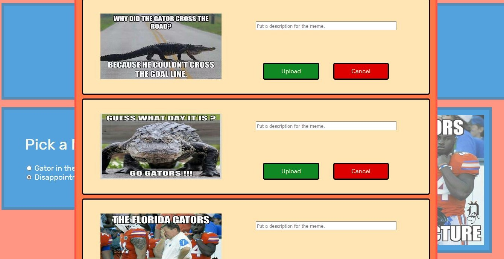

# Meme_Loader

## Description
My final project for CIS4390, Web Applications. It is a project that shows what we learned during the semester.
This a app uploads memes from a user's local machine to a server.

## Screenshots

### Home Screen

### Upload meme popup

